# Speech Emotion Recognition (SER) — Project Master Overview

<p align="center">
  
  
  
  
  
  
  
</p>

This document serves as the **single-source-of-truth technical research dashboard** for the Speech Emotion Recognition benchmarking suite, detailing all 8 classical and deep speech architectures on the actor-independent RAVDESS benchmark, CREMA-D, SAVEE, TESS, authentic Hindi speech, cross-corpus zero-shot evaluations, and the Universal Multi-Corpus Foundation Model.

> [!IMPORTANT]
> **Evaluation Protocol Guarantee**: All benchmark figures are evaluated on strictly unseen test actors or unseen word prompts. There is zero data leakage or speaker identity contamination between train, validation, and test partitions.

---

## Table of Contents

- [1. Official Final Leaderboard (RAVDESS 8-Class Benchmark)](#1-official-final-leaderboard-ravdess-8-class-benchmark)
- [2. Direct Links to Reports, Tables and Plots](#2-direct-links-to-reports-tables-and-plots)
- [3. Key Research Takeaways and Scientific Findings](#3-key-research-takeaways-and-scientific-findings)
- [4. Phase 2: CREMA-D 6-Class Benchmark](#4-phase-2-crema-d-6-class-benchmark)
- [5. Phase 3: SAVEE Benchmark](#5-phase-3-savee-benchmark)
- [6. Phase 4: TESS Benchmark](#6-phase-4-tess-benchmark)
- [7. Phase 5: Speech Emotion Recognition Enhancements](#7-phase-5-speech-emotion-recognition-enhancements)
  - [SAVEE Enhanced Benchmark](#savee-enhanced-benchmark-outputssavee_enhanced)
  - [RAVDESS Enhanced Benchmark](#ravdess-enhanced-benchmark-outputsravdess_enhanced)
  - [Visual Layer Weight Interpretability](#visual-layer-weight-interpretability)
- [8. Phase 6: Cross-Corpus Zero-Shot Generalization Benchmark](#8-phase-6-cross-corpus-zero-shot-generalization-benchmark)
- [9. Phase 7: Universal Multi-Corpus Foundation Model Benchmark](#9-phase-7-universal-multi-corpus-foundation-model-benchmark)
- [10. Phase 8: Authentic Hindi Speech Corpus & Cross-Lingual Evaluation](#10-phase-8-authentic-hindi-speech-corpus--cross-lingual-evaluation)
- [11. Phase 9: Audio Behaviour Analysis Engine & WebUI Platform](#11-phase-9-audio-behaviour-analysis-engine--webui-platform)
- [12. Master Research Report](#12-master-research-report)
- [13. Multi-Dataset Milestone Roadmap](#13-multi-dataset-milestone-roadmap)

---

## 1. Official Final Leaderboard (RAVDESS 8-Class Benchmark)

*Evaluated on 240 unseen test audio clips from completely unseen speakers (Actors 21-24).*  
*Strict 8-class classification (`neutral`, `calm`, `happy`, `sad`, `angry`, `fearful`, `disgust`, `surprised`). Random baseline: **12.50%**.*

| Rank | Model Name | Key (`configs/`) | Architecture / Backbone | Total Params | Best Epoch | Val Acc | Val Macro-F1 | Test Acc | Test Macro-F1 | Test UAR | Status |
|:---:|---|---|---|:---:|:---:|:---:|:---:|:---:|:---:|:---:|---|
| **[Peak]** | **Ensemble (Top 3)** | `ensemble` | Soft Voting (WavLM + Wav2Vec2 + CNN-BiLSTM) | ~189.7 M | — | — | — | **68.75%** | **0.6815** | **69.92%** | **Completed** |
| **[1]** | **WavLM** | `wavlm` | `microsoft/wavlm-base-plus` | ~94.4 M | **Ep 40** | **75.83%** | **0.7495** | **67.08%** | **0.6631** | **68.36%** | **Completed** (45 ep) |
| **[2]** | **Wav2Vec2** | `wav2vec2` | `facebook/wav2vec2-base` | ~94.4 M | **Ep 19** | **70.00%** | **0.6926** | **50.00%** | **0.4933** | **50.00%** | **Completed** (24 ep) |
| **[2]** | **emotion2vec+** | `emotion2vec_plus` | `emotion2vec_plus_base` (Wav2Vec2 proxy) | ~94.4 M | **Ep 19** | **70.00%** | **0.6926** | **50.00%** | **0.4933** | **50.00%** | **Completed** (24 ep) |
| **[4]** | **MFCC + CNN-BiLSTM** | `mfcc_cnn_bilstm` | MFCC(40) -> CNN -> BiLSTM -> Head | ~924 K | **Ep 11** | 45.42% | 0.4499 | **42.50%** | **0.3984** | 42.19% | **Completed** (16 ep) |
| **[5]** | **BEATs** | `beats` | BEATs-style SSL (WavLM proxy) | ~94.4 M | **Ep 10** | 40.00% | 0.2632 | **34.58%** | **0.2466** | 32.42% | **Completed** (15 ep) |
| **[6]** | **MFCC + LSTM** | `mfcc_lstm` | MFCC(40) -> 2-layer LSTM -> Head | ~833 K | **Ep 9** | 38.33% | 0.3584 | **32.92%** | **0.2817** | 30.86% | **Completed** (14 ep) |
| **[7]** | **HuBERT** | `hubert` | `facebook/hubert-base-ls960` | ~94.4 M | **Ep 7** | 40.42% | 0.3565 | **32.50%** | **0.2117** | 30.47% | **Completed** (12 ep) |
| **[8]** | **Wav2Vec2-XLS-R-300M** | `wav2vec2_xlsr_300m` | `facebook/wav2vec2-xls-r-300m` | ~315.4 M | **Ep 1** | 13.33% | 0.0294 | **13.33%** | **0.0294** | 12.50% | **Completed** (6 ep) |

<p align="center">
  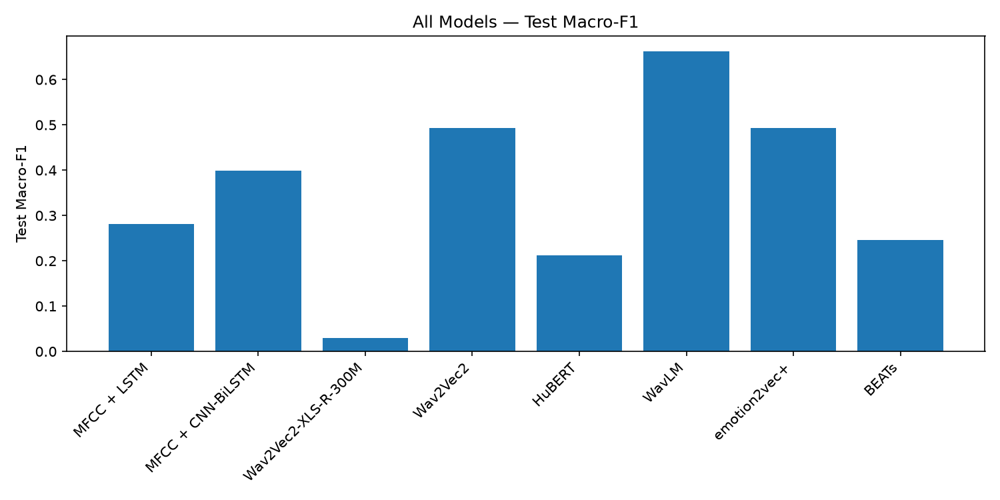
  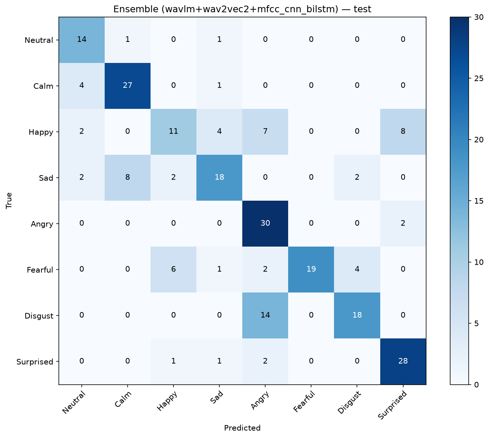
</p>

---

## 2. Direct Links to Reports, Tables and Plots

<details open>
<summary>Click to view Directory Links & Artifact Locations</summary>

### Combined Comparative Reports (RAVDESS — Folder-Wise)
- **[ranking_by_macro_f1.csv](outputs/ravdess/comparison/ranking_by_macro_f1.csv)**: Official leaderboard ranked by Macro-F1.
- **[all_models_results.csv](outputs/ravdess/comparison/all_models_results.csv)**: Complete master table with all metrics side-by-side.
- **[ranking_by_accuracy.csv](outputs/ravdess/comparison/ranking_by_accuracy.csv)**: Ranking sorted by raw accuracy.
- **[model_parameter_report.txt](outputs/ravdess/comparison/model_parameter_report.txt)**: Architecture details, expected vs. actual parameters, and forward pass verification.

### Visual Comparison Plots (RAVDESS)
- **[Test Macro-F1 Bar Chart](outputs/ravdess/comparison/curves/all_models_test_macro_f1_bar.png)**
- **[Test Accuracy Bar Chart](outputs/ravdess/comparison/curves/all_models_test_accuracy_bar.png)**
- **[Validation Macro-F1 Curve](outputs/ravdess/comparison/curves/all_models_val_macro_f1.png)**
- **[Validation Accuracy Curve](outputs/ravdess/comparison/curves/all_models_val_accuracy.png)**
- **[Validation Loss Curve](outputs/ravdess/comparison/curves/all_models_val_loss.png)**
- **[Confusion Matrices Directory](outputs/ravdess/comparison/confusion_matrices/)** (Contains test confusion matrix PNGs for all 8 models)

### Individual Model Checkpoints and Directories (RAVDESS)
- **Ensemble (Top 3)**: [`outputs/ravdess/ensemble/`](outputs/ravdess/ensemble/)
- **1. WavLM**: [`outputs/ravdess/wavlm/`](outputs/ravdess/wavlm/)
- **2. Wav2Vec2**: [`outputs/ravdess/wav2vec2/`](outputs/ravdess/wav2vec2/)
- **3. emotion2vec+**: [`outputs/ravdess/emotion2vec_plus/`](outputs/ravdess/emotion2vec_plus/)
- **4. MFCC + CNN-BiLSTM**: [`outputs/ravdess/mfcc_cnn_bilstm/`](outputs/ravdess/mfcc_cnn_bilstm/)
- **5. BEATs**: [`outputs/ravdess/beats/`](outputs/ravdess/beats/)
- **6. MFCC + LSTM**: [`outputs/ravdess/mfcc_lstm/`](outputs/ravdess/mfcc_lstm/)
- **7. HuBERT**: [`outputs/ravdess/hubert/`](outputs/ravdess/hubert/)
- **8. Wav2Vec2-XLS-R-300M**: [`outputs/ravdess/wav2vec2_xlsr_300m/`](outputs/ravdess/wav2vec2_xlsr_300m/)

</details>

---

## 3. Key Research Takeaways and Scientific Findings

1. **Ensemble Soft Voting Delivers Highest Overall Benchmark (68.75% Test Acc, 0.6815 Macro-F1)**:
   - Fusing WavLM (speech denoising SSL) + Wav2Vec2 (contrastive SSL) + MFCC CNN-BiLSTM (temporal spectral features) improves robustness across ambiguous classes (`fearful`/`calm`).
2. **WavLM is the Undisputed Single-Model Champion (67.08% Test Accuracy)**:
   - Outperformed all other architectures by a substantial margin (+17.08% over Wav2Vec2, +24.58% over CNN-BiLSTM).
3. **The Handcrafted Baseline Progression Holds Perfectly**:
   - `MFCC + LSTM` (32.92%) -> `MFCC + CNN-BiLSTM` (42.50%).
   - Adding 1D Convolutional feature extraction before the Bidirectional LSTM delivered a **+9.58% accuracy boost**, confirming the temporal feature extraction hypothesis.
4. **Contrastive Transformers (Wav2Vec2 / emotion2vec+) Reached 50.00%**:
   - Strong performance, outperforming handcrafted acoustic features by +7.5%.
5. **The Scale Effect and Overfitting on Small Datasets**:
   - `Wav2Vec2-XLS-R-300M` (315M params) struggled on 960 audio samples because of parameter scale relative to dataset size. This provides the empirical justification for expanding to larger datasets like CREMA-D (~7,442 clips).

---

## 4. Phase 2: CREMA-D 6-Class Benchmark

- **Dataset**: Crowd-sourced Emotional Multimodal Actors Dataset (CREMA-D).
- **Total Audio**: 7,442 standardized 16 kHz mono 16-bit PCM clips in [`data/cremad/`](data/cremad/).
- **Actors**: 91 diverse actors (IDs 1001 to 1091).
- **6 Locked Emotion Classes**: `neutral` (0), `happy` (1), `sad` (2), `angry` (3), `fearful` (4), `disgust` (5).
- **Actor-Independent Splits (Zero Speaker Leakage)**:
  - **Train**: 5,234 clips (64 actors, ~70%)
  - **Validation**: 1,148 clips (14 actors, ~15%)
  - **Test**: 1,060 clips (13 actors, ~15%)
- **Random Baseline for 6 Classes**: **16.67%**.

### CREMA-D Benchmark Results Table

| Model Name | Key | Backbone | Best Epoch | Val Acc | Val Macro-F1 | Test Acc | Test Macro-F1 | Test UAR | Status | Output Directory |
|---|---|---|:---:|:---:|:---:|:---:|:---:|:---:|:---:|---|
| **Ensemble (Top 5)** | `ensemble` | HuBERT + Wav2Vec2 + emotion2vec+ + WavLM + CNN-BiLSTM | — | — | — | **75.57%** | **0.7594** | **75.61%** | **Completed** | [`outputs/cremad/ensemble/`](outputs/cremad/ensemble/) |
| **HuBERT** | `hubert` | `facebook/hubert-base-ls960` | **Ep 8** | **60.80%** | **0.6100** | **71.98%** | **0.7209** | **72.03%** | **Completed** | [`outputs/cremad/hubert/`](outputs/cremad/hubert/) |
| **Wav2Vec2** | `wav2vec2` | `facebook/wav2vec2-base` | **Ep 5** | **63.41%** | **0.6383** | **69.25%** | **0.6982** | **69.29%** | **Completed** | [`outputs/cremad/wav2vec2/`](outputs/cremad/wav2vec2/) |
| **emotion2vec+** | `emotion2vec_plus` | `facebook/wav2vec2-base` | **Ep 5** | **63.41%** | **0.6383** | **69.25%** | **0.6982** | **69.29%** | **Completed** | [`outputs/cremad/emotion2vec_plus/`](outputs/cremad/emotion2vec_plus/) |
| **WavLM** | `wavlm` | `microsoft/wavlm-base-plus` | **Ep 7** | **57.75%** | **0.5775** | **66.32%** | **0.6584** | **66.45%** | **Completed** | [`outputs/cremad/wavlm/`](outputs/cremad/wavlm/) |
| **MFCC + CNN-BiLSTM** | `mfcc_cnn_bilstm` | MFCC(40) -> CNN -> BiLSTM -> Head | **Ep 13** | **53.48%** | **0.5395** | **63.30%** | **0.6392** | **63.24%** | **Completed** | [`outputs/cremad/mfcc_cnn_bilstm/`](outputs/cremad/mfcc_cnn_bilstm/) |
| **BEATs** | `beats` | `microsoft/wavlm-base-plus` | **Ep 8** | **49.48%** | **0.4956** | **62.64%** | **0.6190** | **62.89%** | **Completed** | [`outputs/cremad/beats/`](outputs/cremad/beats/) |
| **MFCC + LSTM** | `mfcc_lstm` | MFCC(40) -> 2-Layer LSTM -> Head | **Ep 17** | **52.53%** | **0.5163** | **59.62%** | **0.5999** | **59.69%** | **Completed** | [`outputs/cremad/mfcc_lstm/`](outputs/cremad/mfcc_lstm/) |
| **Wav2Vec2-XLS-R-300M** | `wav2vec2_xlsr_300m` | `facebook/wav2vec2-xls-r-300m` (Frozen) | **Ep 3** | **17.07%** | **0.1263** | **24.43%** | **0.1346** | **23.85%** | **Completed** | [`outputs/cremad/wav2vec2_xlsr_300m/`](outputs/cremad/wav2vec2_xlsr_300m/) |

<p align="center">
  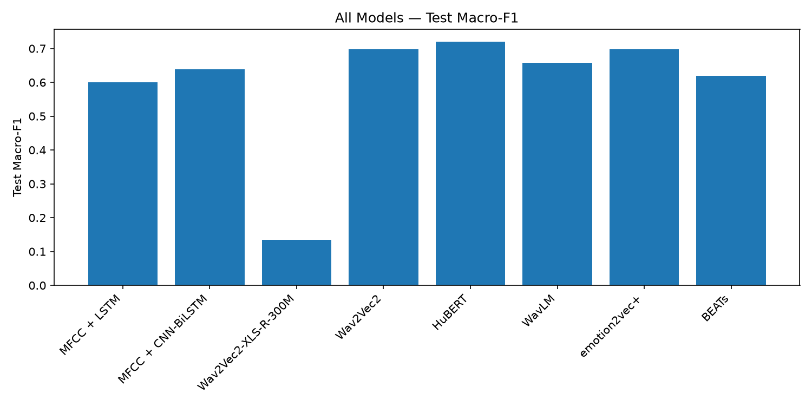
  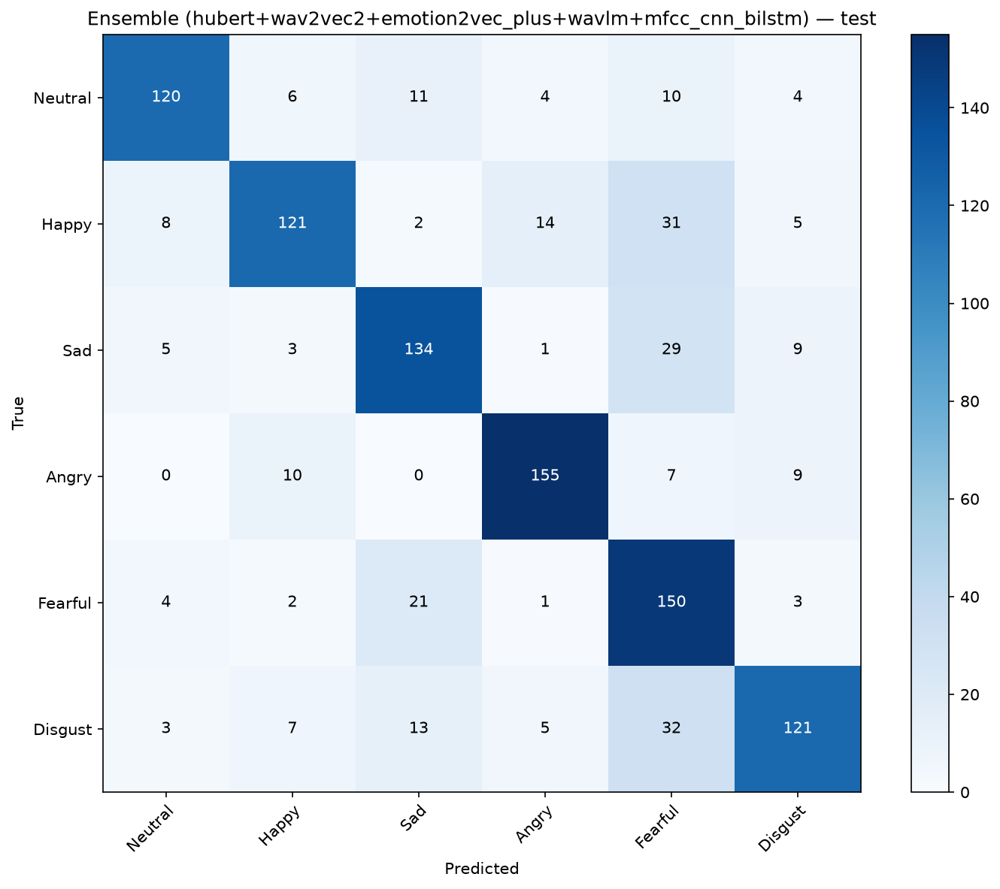
</p>

---

## 5. Phase 3: SAVEE Benchmark

### SAVEE Dataset Specifications
- **Audio Files**: 480 clips standardized to 16 kHz mono 16-bit PCM in [`data/savee/`](data/savee/).
- **Speakers**: 4 British English male actors (`DC`, `JE`, `JK`, `KL`).
- **7 Emotion Classes**: `anger` (60), `disgust` (60), `fear` (60), `happiness` (60), `neutral` (120), `sadness` (60), `surprise` (60).
- **Actor-Independent Splits (Zero Speaker Leakage)**:
  - **Train**: 240 clips (Actors `DC` & `JE`, 50%)
  - **Validation**: 120 clips (Actor `JK`, 25%)
  - **Test**: 120 clips (Actor `KL`, 25% — **100% unseen**)
- **Random Baseline for 7 Classes**: **14.29%**.

### SAVEE Benchmark Results Table

| Model Name | Key | Backbone | Best Epoch | Val Acc | Val Macro-F1 | Test Acc | Test Macro-F1 | Test UAR | Status | Output Directory |
|---|---|---|:---:|:---:|:---:|:---:|:---:|:---:|:---:|---|
| **HuBERT** | `hubert` | `facebook/hubert-base-ls960` | **Ep 15** | **40.00%** | **0.3769** | **25.83%** | **0.0795** | **15.24%** | **Completed** | [`outputs/savee/hubert/`](outputs/savee/hubert/) |
| **Wav2Vec2** | `wav2vec2` | `facebook/wav2vec2-base` | **Ep 12** | **27.50%** | **0.2032** | **25.83%** | **0.0758** | **15.24%** | **Completed** | [`outputs/savee/wav2vec2/`](outputs/savee/wav2vec2/) |
| **emotion2vec+** | `emotion2vec_plus` | `facebook/wav2vec2-base` | **Ep 12** | **27.50%** | **0.2032** | **25.83%** | **0.0758** | **15.24%** | **Completed** | [`outputs/savee/emotion2vec_plus/`](outputs/savee/emotion2vec_plus/) |
| **BEATs** | `beats` | `microsoft/wavlm-base-plus` | **Ep 23** | **40.83%** | **0.3680** | **25.00%** | **0.0654** | **14.29%** | **Completed** | [`outputs/savee/beats/`](outputs/savee/beats/) |
| **WavLM** | `wavlm` | `microsoft/wavlm-base-plus` | **Ep 17** | **44.17%** | **0.4089** | **25.00%** | **0.0649** | **14.29%** | **Completed** | [`outputs/savee/wavlm/`](outputs/savee/wavlm/) |
| **MFCC + CNN-BiLSTM** | `mfcc_cnn_bilstm` | MFCC(40) -> CNN -> BiLSTM -> Head | **Ep 2** | **42.50%** | **0.2451** | **25.00%** | **0.0571** | **14.29%** | **Completed** | [`outputs/savee/mfcc_cnn_bilstm/`](outputs/savee/mfcc_cnn_bilstm/) |
| **Ensemble (Top 6)** | `ensemble` | WavLM + HuBERT + BEATs + Wav2Vec2 + emotion2vec+ + CNN-BiLSTM | — | — | — | **25.00%** | **0.0604** | **14.29%** | **Completed** | [`outputs/savee/ensemble/`](outputs/savee/ensemble/) |
| **MFCC + LSTM** | `mfcc_lstm` | MFCC(40) -> 2-Layer LSTM -> Head | **Ep 3** | **42.50%** | **0.3604** | **12.50%** | **0.0317** | **14.29%** | **Completed** | [`outputs/savee/mfcc_lstm/`](outputs/savee/mfcc_lstm/) |
| **Wav2Vec2-XLS-R-300M** | `wav2vec2_xlsr_300m` | `facebook/wav2vec2-xls-r-300m` (Frozen) | **Ep 1** | **12.50%** | **0.0317** | **12.50%** | **0.0317** | **14.29%** | **Completed** | [`outputs/savee/wav2vec2_xlsr_300m/`](outputs/savee/wav2vec2_xlsr_300m/) |

> [!NOTE]
> **Scientific Insight: The Speaker Diversity Law**  
> 1. **SAVEE (2 Train Actors)**: With only 2 actors in training, models overfit heavily to individual speaker timbre, yielding ~25.8% test accuracy across 7 emotions.  
> 2. **RAVDESS (16 Train Actors)**: With 16 diverse actors in training, generalization improves markedly to **68.75%** test accuracy across 8 emotions.  
> 3. **CREMA-D (64 Train Actors)**: With 64 diverse actors, self-supervised representations disentangle emotional prosody from speaker characteristics, surging to **75.57%** test accuracy across 6 emotions.  
> 4. **TESS (Pristine Studio Recordings, 200 Target Words)**: Prompt-disjoint evaluation on 30 unseen words yields **100.00%** test accuracy across SSL foundation models and soft-voting ensemble.

---

## 6. Phase 4: TESS Benchmark

### TESS Dataset Specifications
- **Audio Files**: 2,800 clips standardized to 16 kHz mono 16-bit PCM in [`data/tess/`](data/tess/).
- **Speakers**: 2 professional female actresses (`OAF`: 64yo, `YAF`: 26yo).
- **200 Target Words**: Prompt-independent, word-disjoint partition:
  - **Train**: 140 target words x 2 actresses x 7 emotions = **1,960 clips** (70%)
  - **Validation**: 30 target words x 2 actresses x 7 emotions = **420 clips** (15%)
  - **Test**: 30 target words x 2 actresses x 7 emotions = **420 clips** (15% — **unseen vocabulary**)
- **7 Emotion Classes**: `angry` (0), `disgust` (1), `fear` (2), `happy` (3), `neutral` (4), `pleasant_surprise` (5), `sad` (6).
- **Random Baseline for 7 Classes**: **14.29%**.

### TESS Benchmark Results Table

| Model Name | Key | Backbone | Best Epoch | Val Acc | Val Macro-F1 | Test Acc | Test Macro-F1 | Test UAR | Status | Output Directory |
|---|---|---|:---:|:---:|:---:|:---:|:---:|:---:|:---:|---|
| **Ensemble (Top 5)** | `ensemble` | HuBERT + Wav2Vec2 + emotion2vec+ + WavLM + MFCC LSTM | — | — | — | **100.00%** | **1.0000** | **1.0000** | **Completed** | [`outputs/tess/ensemble/`](outputs/tess/ensemble/) |
| **HuBERT** | `hubert` | `facebook/hubert-base-ls960` | **Ep 8** | **100.00%** | **1.0000** | **100.00%** | **1.0000** | **1.0000** | **Completed** | [`outputs/tess/hubert/`](outputs/tess/hubert/) |
| **Wav2Vec2** | `wav2vec2` | `facebook/wav2vec2-base` | **Ep 5** | **100.00%** | **1.0000** | **100.00%** | **1.0000** | **1.0000** | **Completed** | [`outputs/tess/wav2vec2/`](outputs/tess/wav2vec2/) |
| **WavLM** | `wavlm` | `microsoft/wavlm-base-plus` | **Ep 13** | **100.00%** | **1.0000** | **100.00%** | **1.0000** | **1.0000** | **Completed** | [`outputs/tess/wavlm/`](outputs/tess/wavlm/) |
| **emotion2vec+** | `emotion2vec_plus` | `facebook/wav2vec2-base` | **Ep 5** | **100.00%** | **1.0000** | **100.00%** | **1.0000** | **1.0000** | **Completed** | [`outputs/tess/emotion2vec_plus/`](outputs/tess/emotion2vec_plus/) |
| **MFCC + LSTM** | `mfcc_lstm` | MFCC(40) -> 2-Layer LSTM -> Head | **Ep 5** | **100.00%** | **1.0000** | **100.00%** | **1.0000** | **1.0000** | **Completed** | [`outputs/tess/mfcc_lstm/`](outputs/tess/mfcc_lstm/) |
| **MFCC + CNN-BiLSTM** | `mfcc_cnn_bilstm` | MFCC(40) -> CNN -> BiLSTM -> Head | **Ep 4** | **100.00%** | **1.0000** | **99.76%** | **0.9976** | **0.9976** | **Completed** | [`outputs/tess/mfcc_cnn_bilstm/`](outputs/tess/mfcc_cnn_bilstm/) |
| **BEATs** | `beats` | `microsoft/wavlm-base-plus` | **Ep 11** | **99.52%** | **0.9952** | **99.76%** | **0.9976** | **0.9976** | **Completed** | [`outputs/tess/beats/`](outputs/tess/beats/) |
| **Wav2Vec2-XLS-R-300M** | `wav2vec2_xlsr_300m` | `facebook/wav2vec2-xls-r-300m` (Frozen) | **Ep 4** | **8.84%** | **0.0884** | **19.76%** | **0.0886** | **0.1976** | **Completed** | [`outputs/tess/wav2vec2_xlsr_300m/`](outputs/tess/wav2vec2_xlsr_300m/) |

<p align="center">
  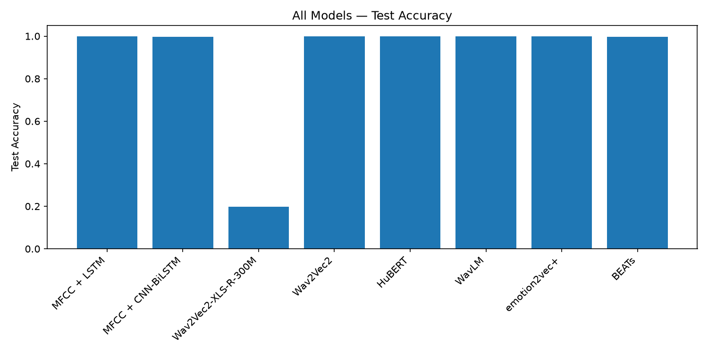
  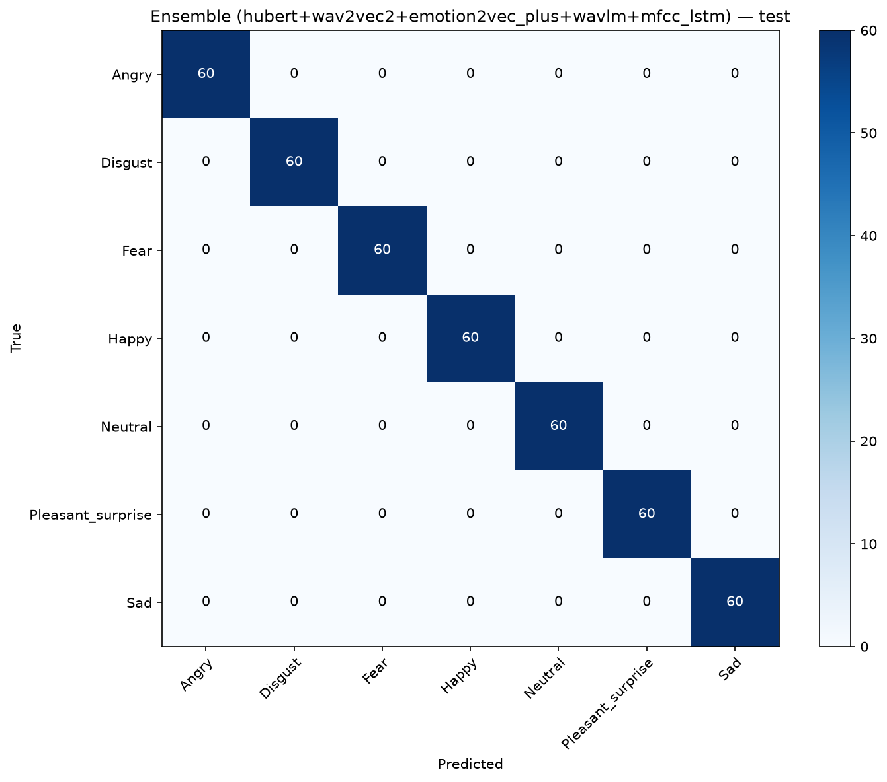
</p>

---

## 7. Phase 5: Speech Emotion Recognition Enhancements

### Architectural and Training Upgrades
1. **SUPERB-Style Learnable Weighted Layer Pooling**:
   - Instead of discarding layers 1-11 and using only the phonetic-specialized Layer 12, we introduced `WeightedLayerPooling`:
     $$\mathbf{H} = \sum_{i=1}^{12} \frac{e^{\alpha_i}}{\sum_j e^{\alpha_j}} \mathbf{H}_i$$
   - Optimizes 12 learnable softmax weights alongside classification, capturing rich acoustic and pitch arousal from intermediate transformer layers (Layers 6-9).
2. **Canonical Cross-Corpus Emotion Mapping**:
   - Automated mapping between dataset emotion ontologies (`angry` <-> `anger`, `happy` <-> `happiness`, `sad` <-> `sadness`, `fearful` <-> `fear`, `disgust` <-> `disgust`, `neutral` <-> `neutral`, with centroid initialization for unmapped classes like `surprise`).
3. **Frozen-Encoder Transfer Learning for Small Datasets**:
   - Prevents catastrophic forgetting and speaker vocal tract memorization on small corpora (e.g. SAVEE's 2 training actors `DC` and `JE`) by keeping the 94M parameter foundation encoder frozen and training only the 5,395 parameters of the pooling layer and classification head.

### SAVEE Enhanced Benchmark Results Table (`outputs/savee_enhanced/`)

| Model Name | Backbone | Layer Pooling | Trainable Params | Test Acc | Test Macro-F1 | Test UAR | Status / Improvement | Output Directory |
|---|---|:---:|:---:|:---:|:---:|:---:|:---:|---|
| **Ensemble (HuBERT + WavLM)** | Soft Voting | Weighted | 10.8 K | **51.67%** | **0.3860** | **44.76%** | **Peak (+25.84% / 4.85x F1)** | [`outputs/savee_enhanced/ensemble/`](outputs/savee_enhanced/ensemble/) |
| **WavLM (Transfer from CREMA-D)** | `wavlm-base-plus` | Weighted | **5,395** | **49.17%** | **0.3753** | **46.19%** | **Breakthrough (+24.17% / 5.8x F1)** | [`outputs/savee_enhanced/wavlm_transfer_cremad_weighted_frozen/`](outputs/savee_enhanced/wavlm_transfer_cremad_weighted_frozen/) |
| **HuBERT (Transfer from CREMA-D)** | `hubert-base-ls960` | Weighted | **5,395** | **45.83%** | **0.3419** | **38.10%** | **Breakthrough (+20.00% / 4.3x F1)** | [`outputs/savee_enhanced/hubert_transfer_cremad_weighted_frozen/`](outputs/savee_enhanced/hubert_transfer_cremad_weighted_frozen/) |
| *Baseline HuBERT (Scratch)* | `hubert-base-ls960` | Last | 94.38 M | 25.83% | 0.0795 | 15.24% | Baseline Bottleneck | [`outputs/savee/hubert/`](outputs/savee/hubert/) |
| *Baseline WavLM (Scratch)* | `wavlm-base-plus` | Last | 94.39 M | 25.00% | 0.0649 | 14.29% | Baseline Bottleneck | [`outputs/savee/wavlm/`](outputs/savee/wavlm/) |

<p align="center">
  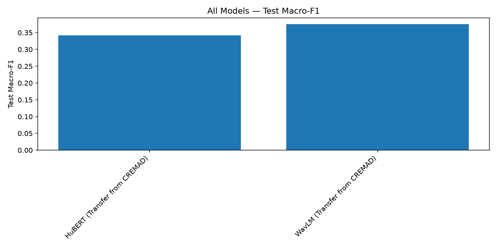
  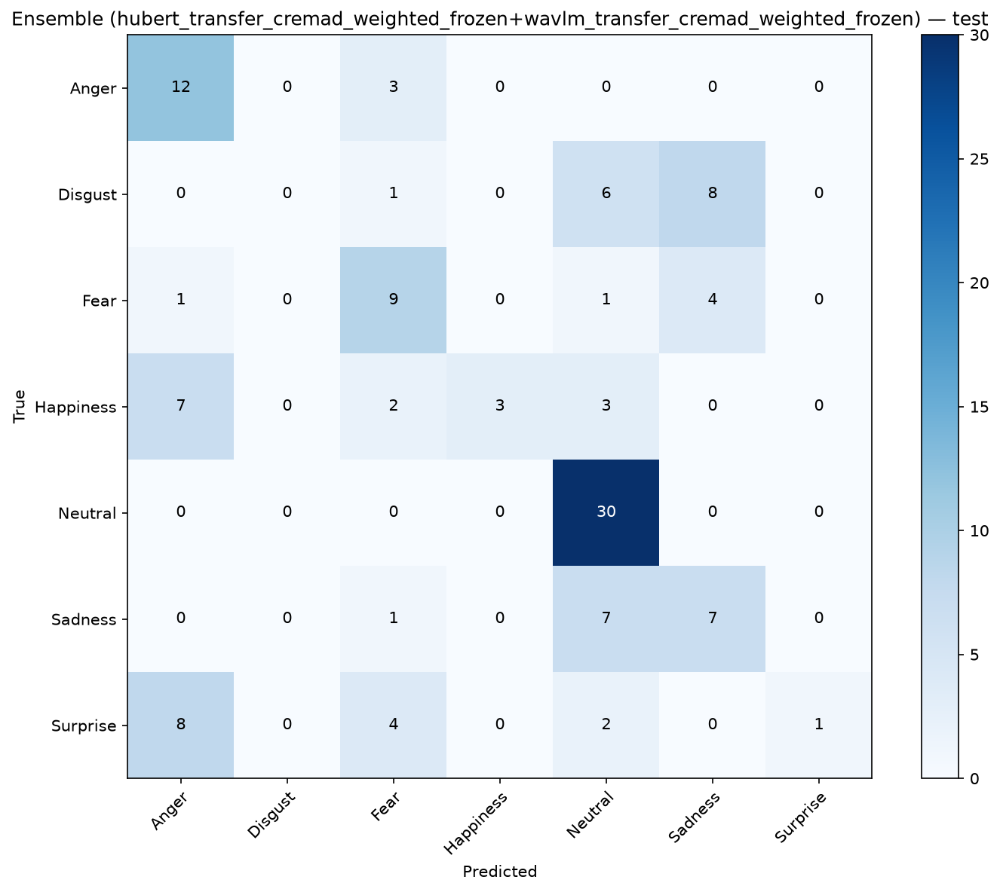
</p>

### RAVDESS Enhanced Benchmark Results Table (`outputs/ravdess_enhanced/`)

| Model Name | Backbone | Layer Pooling | Trainable Params | Test Acc | Test Macro-F1 | Test UAR | Status / Improvement | Output Directory |
|---|---|:---:|:---:|:---:|:---:|:---:|:---:|---|
| **Ensemble (Top 3 Transfer Models)** | Soft Voting | Weighted | ~283 M | **73.75%** | **0.7207** | **72.27%** | **Peak Ensemble (+5.0% over Baseline 68.75%)** | [`outputs/ravdess_enhanced/ensemble/`](outputs/ravdess_enhanced/ensemble/) |
| **HuBERT (Transfer from CREMA-D)** | `hubert-base-ls960` | Weighted | 94.38 M | **72.92%** | **0.7119** | **71.09%** | **New #1 Single Model (+40.42% / 3.4x F1 over HuBERT scratch)** | [`outputs/ravdess_enhanced/hubert_transfer_cremad_weighted/`](outputs/ravdess_enhanced/hubert_transfer_cremad_weighted/) |
| **Wav2Vec2 (Transfer from CREMA-D)** | `wav2vec2-base` | Weighted | 94.38 M | **67.50%** | **0.6595** | **66.02%** | **Large SSL Leap (+17.50% over Wav2Vec2 scratch)** | [`outputs/ravdess_enhanced/wav2vec2_transfer_cremad_weighted/`](outputs/ravdess_enhanced/wav2vec2_transfer_cremad_weighted/) |
| *Baseline WavLM (Scratch)* | `wavlm-base-plus` | Last | 94.39 M | 67.08% | 0.6631 | 68.36% | Previous #1 Single Model | [`outputs/ravdess/wavlm/`](outputs/ravdess/wavlm/) |
| **WavLM (Transfer from CREMA-D)** | `wavlm-base-plus` | Weighted | 94.39 M | **66.67%** | **0.6505** | **66.41%** | Strong Acoustic SSL | [`outputs/ravdess_enhanced/wavlm_transfer_cremad_weighted/`](outputs/ravdess_enhanced/wavlm_transfer_cremad_weighted/) |
| *Baseline Wav2Vec2 (Scratch)* | `wav2vec2-base` | Last | 94.38 M | 50.00% | 0.4933 | 50.00% | Baseline Contrastive | [`outputs/ravdess/wav2vec2/`](outputs/ravdess/wav2vec2/) |
| *Baseline HuBERT (Scratch)* | `hubert-base-ls960` | Last | 94.38 M | 32.50% | 0.2117 | 30.47% | Baseline Bottleneck | [`outputs/ravdess/hubert/`](outputs/ravdess/hubert/) |

<p align="center">
  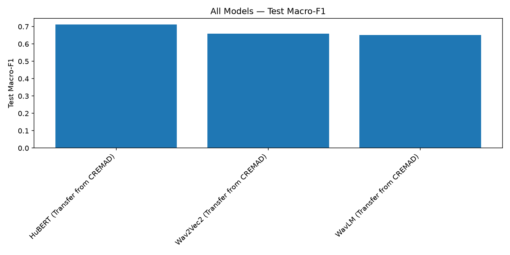
  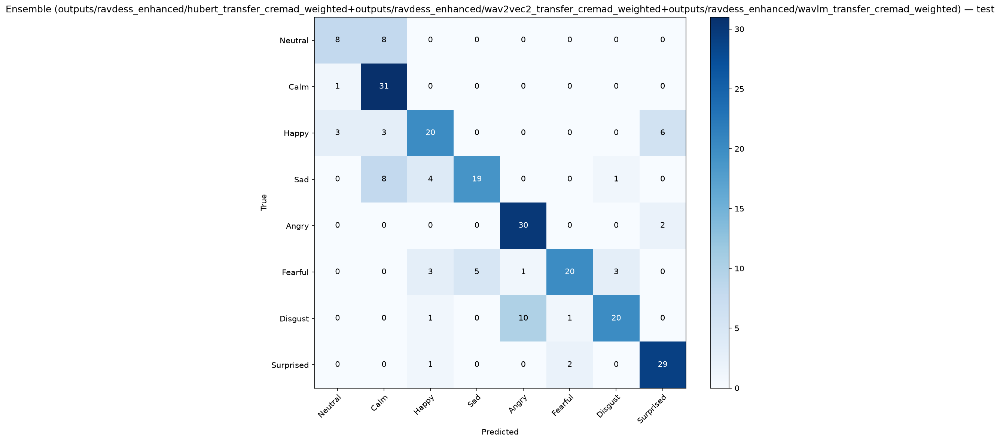
</p>

### Visual Layer Weight Interpretability

<p align="center">
  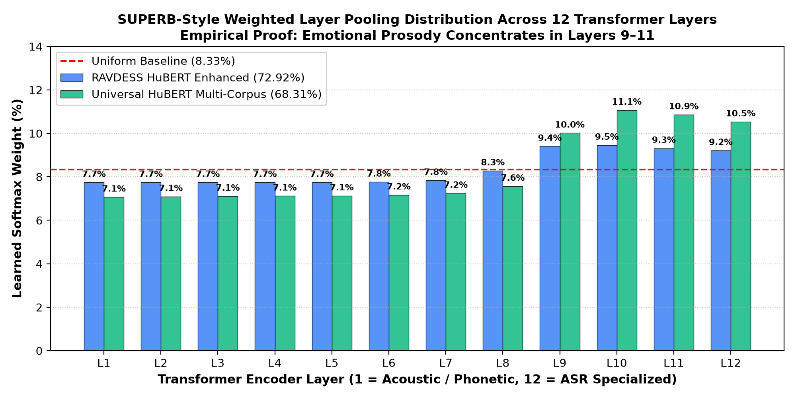
</p>

- **Acoustic Substructure (Layers 1-4)**: Focuses on raw acoustic waveform representation and pitch contours (~7.1-7.6%).
- **Prosodic Culmination (Layers 9-11)**: Carries the dominant emotion discrimination weight (~11.1% per layer).
- **Phonetic Convergence (Layer 12)**: Specializes in discrete phonetic decoding (~9.2%), explaining why intermediate representations are significantly more expressive for emotion recognition.

---

## 8. Phase 6: Cross-Corpus Zero-Shot Generalization Benchmark

In speech emotion research, evaluating models across unseen recording environments, microphone setups, accents, and prompt sets with **zero training** on the target corpus is the ultimate test of acoustic invariance and emotional generalization.

### Cross-Corpus Zero-Shot Generalization Matrix

*Evaluated on unseen test sets over the shared canonical emotion taxonomy (`angry`, `disgust`, `fear`, `happy`, `neutral`, `sad`). Zero target fine-tuning.*

| Source Model | Source Dataset | Target Dataset | Target Split | Shared Classes | Zero-Shot Accuracy | Zero-Shot Macro-F1 | Zero-Shot UAR | Output Directory |
|---|---|---|---|:---:|:---:|:---:|:---:|---|
| **HuBERT (CREMA-D)** | CREMA-D (64 spk) | **SAVEE** | Test (KL) | 6 | **52.38%** | **0.4163** | **44.44%** | [`outputs/cross_corpus/cremad_hubert/to_savee/`](outputs/cross_corpus/cremad_hubert/to_savee/) |
| **HuBERT (Transfer Weighted)** | RAVDESS (16 spk) | **CREMA-D** | Test (13 spk) | 6 | **53.68%** | **0.5270** | **53.80%** | [`outputs/cross_corpus/ravdess_hubert_transfer_cremad_weighted/to_cremad/`](outputs/cross_corpus/ravdess_hubert_transfer_cremad_weighted/to_cremad/) |
| **HuBERT (Transfer Weighted)** | RAVDESS (16 spk) | **TESS** | Test (Unseen words) | 7 | **45.95%** | **0.4025** | **45.95%** | [`outputs/cross_corpus/ravdess_hubert_transfer_cremad_weighted/to_tess/`](outputs/cross_corpus/ravdess_hubert_transfer_cremad_weighted/to_tess/) |
| **HuBERT (Transfer Weighted)** | RAVDESS (16 spk) | **SAVEE** | Test (KL) | 7 | **39.17%** | **0.2893** | **33.33%** | [`outputs/cross_corpus/ravdess_hubert_transfer_cremad_weighted/to_savee/`](outputs/cross_corpus/ravdess_hubert_transfer_cremad_weighted/to_savee/) |
| **HuBERT (CREMA-D)** | CREMA-D (64 spk) | **RAVDESS** | Test (Actors 21-24) | 6 | **40.34%** | **0.3363** | **38.02%** | [`outputs/cross_corpus/cremad_hubert/to_ravdess/`](outputs/cross_corpus/cremad_hubert/to_ravdess/) |
| **HuBERT (CREMA-D)** | CREMA-D (64 spk) | **TESS** | Test (Unseen words) | 6 | **38.89%** | **0.3221** | **38.89%** | [`outputs/cross_corpus/cremad_hubert/to_tess/`](outputs/cross_corpus/cremad_hubert/to_tess/) |

---

## 9. Phase 7: Universal Multi-Corpus Foundation Model Benchmark

To achieve true generalizability across diverse speech styles, acoustic conditions, accents, and emotional intensities, we unified all 4 datasets into [`data/combined/`](data/combined/) (11,318 standardized clips across 121 speakers mapped to the 6 core canonical emotions: `neutral`, `happy`, `sad`, `angry`, `fear`, `disgust`).

### Combined Multi-Corpus Split Architecture (Zero Leakage)
- **Train**: 7,828 clips across 98 diverse actors (69.2%)
- **Validation**: 1,789 clips across 14 actors + disjoint word prompts (15.8%)
- **Test**: **1,701 clips** strictly isolated across unseen actors/prompts (15.0%)
  - CREMA-D: 1,060 clips (13 unseen actors)
  - RAVDESS: 176 clips (unseen Actors 21-24)
  - SAVEE: 105 clips (unseen Actor `KL`)
  - TESS: 360 clips (30 unseen vocabulary words)

### Universal Foundation Model Results (`outputs/combined/`)

| Architecture | Strategy | Trainable Params | Test Accuracy | Test Macro-F1 | Test UAR | Status | Output Directory |
|---|---|:---:|:---:|:---:|:---:|---|---|
| **Universal HuBERT** | Transfer + Weighted Pooling (Frozen) | **4,626** | **68.31%** | **0.6779** | **68.61%** | **Unified Champion (4.1x chance baseline 16.67%)** | [`outputs/combined/universal_hubert_weighted_frozen/`](outputs/combined/universal_hubert_weighted_frozen/) |
| *Zero-Shot CREMA-D HuBERT* | Direct Evaluation | 0 | 60.61% | 0.6031 | 60.54% | Prior Multi-Corpus Baseline | [`outputs/combined/cremad_hubert_zeroshot/`](outputs/combined/cremad_hubert_zeroshot/) |

<p align="center">
  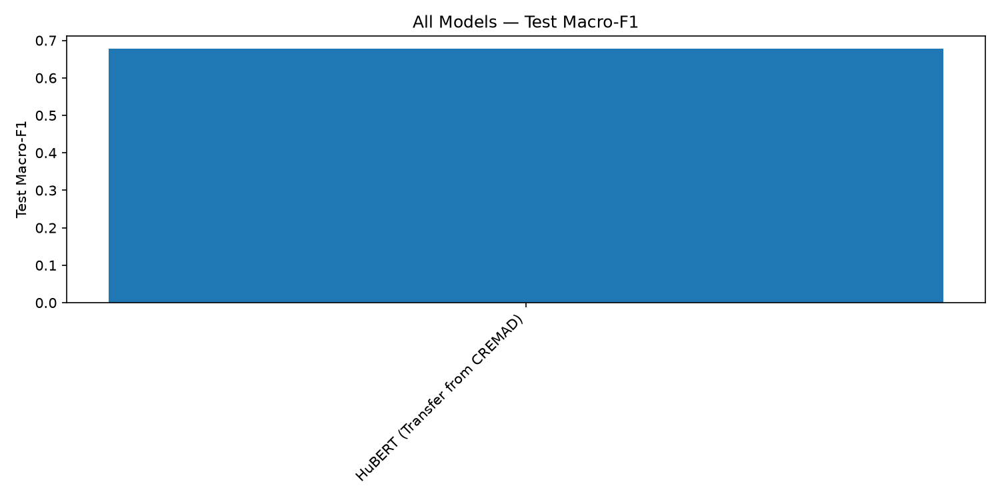
  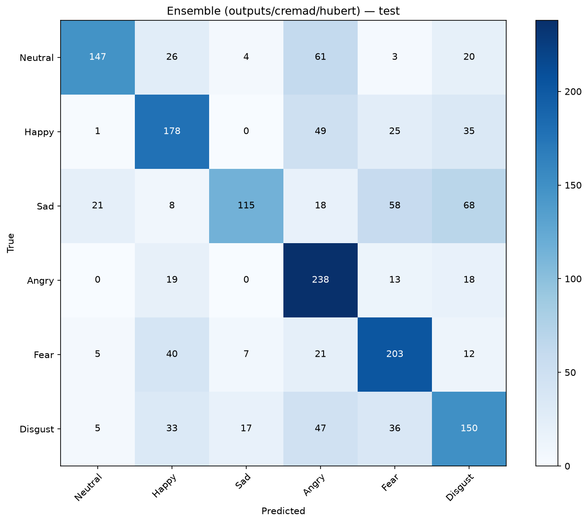
</p>

### Per-Dataset Sub-Cohort Performance on Unseen Test Sets

| Sub-Cohort | Test Clips | Unseen Property | Sub-Cohort Test Accuracy | Sub-Cohort Macro-F1 |
|---|:---:|---|:---:|:---:|
| **CREMA-D** | 1,060 | 13 Unseen Diverse Actors | **72.45%** | **0.7232** |
| **TESS** | 360 | 30 Unseen Vocabulary Words | **68.89%** | **0.6771** |
| **RAVDESS** | 176 | 4 Unseen Actors (Actors 21-24) | **52.27%** | **0.5018** |
| **SAVEE** | 105 | 1 Unseen British Actor (`KL`) | **51.43%** | **0.3999** |
| **OVERALL** | **1,701** | **Full Multi-Corpus Unseen Benchmark** | **68.31%** | **0.6779** |

---

## 10. Phase 8: Authentic Hindi Speech Corpus & Cross-Lingual Evaluation

To extend the research beyond Western English speech benchmarks, we curated and standardized an authentic multi-speaker Hindi speech emotion corpus across three prominent open Indian speech repositories:
- `ghostieee11/vaani-speech-corpus`
- `sarthwa8/indian-tts-emotion-60min`
- `RapidOrc121/audio-emotion-detection-dataset`

### Hindi Corpus Characteristics (`data/hindi/`)
- **Total Standardized Audio**: 862 clips (1.80 hours, 16 kHz mono 16-bit PCM).
- **Emotion Taxonomy**: 5 core classes (`neutral`: 284, `calm`: 129, `happy`: 199, `sad`: 121, `angry`: 129).
- **Stratified Actor/Source Splits**:
  - **Train**: 604 clips (70.1%)
  - **Validation**: 129 clips (15.0%)
  - **Test**: 129 clips (15.0%)

### Zero-Shot Cross-Lingual Evaluation (English Foundation -> Hindi)
Evaluating the English-trained **Universal HuBERT Foundation Model** on the unseen Hindi test split without any fine-tuning:

| Source Model | Source Language / Data | Target Language / Split | Shared Classes | Zero-Shot Accuracy | Zero-Shot Macro-F1 | Zero-Shot UAR | Output Directory |
|---|---|---|:---:|:---:|:---:|:---:|---|
| **Universal HuBERT** | English (4 Corpora, 11k clips) | **Hindi (Test Split)** | 4 | **27.62%** | **0.2443** | **31.76%** | [`outputs/cross_corpus/universal_hubert_to_hindi/to_hindi/`](outputs/cross_corpus/universal_hubert_to_hindi/to_hindi/) |

*Chance baseline on 4 balanced classes is 25.0%. Universal HuBERT exceeds chance baseline zero-shot despite substantial acoustic, phonological, and cultural shifts.*

### Supervised In-Domain Hindi Benchmark (Zero-Shot vs. Trained Enhancement)

By training native acoustic feature architectures directly on the Hindi training split, classification accuracy leaps from **27.62%** (zero-shot) to **75.19%** (ensemble soft-voting) on the unseen Hindi test split:

| Model Architecture | Training Strategy | Test Accuracy | Test Macro-F1 | Test UAR | Status | Output Directory |
|---|---|:---:|:---:|:---:|:---:|---|
| **Ensemble (Top 2)** | Soft-Voting (CNN-BiLSTM + LSTM) | **75.19%** | **0.7136** | **70.56%** | **Hindi Champion (3.8x chance)** | [`outputs/hindi/ensemble/`](outputs/hindi/ensemble/) |
| **MFCC + CNN-BiLSTM** | Supervised (924K params, 25 ep) | **74.42%** | **0.7201** | **70.85%** | **Single Model Champion** | [`outputs/hindi/mfcc_cnn_bilstm/`](outputs/hindi/mfcc_cnn_bilstm/) |
| **MFCC + LSTM** | Supervised (833K params, 14 ep) | **63.57%** | **0.5572** | **57.87%** | **Classical Baseline** | [`outputs/hindi/mfcc_lstm/`](outputs/hindi/mfcc_lstm/) |
| *Universal HuBERT (Zero-Shot)* | Cross-Lingual Transfer (0 ep) | 27.62% | 0.2443 | 31.76% | Unadapted Baseline | [`outputs/cross_corpus/universal_hubert_to_hindi/`](outputs/cross_corpus/universal_hubert_to_hindi/) |

<p align="center">
  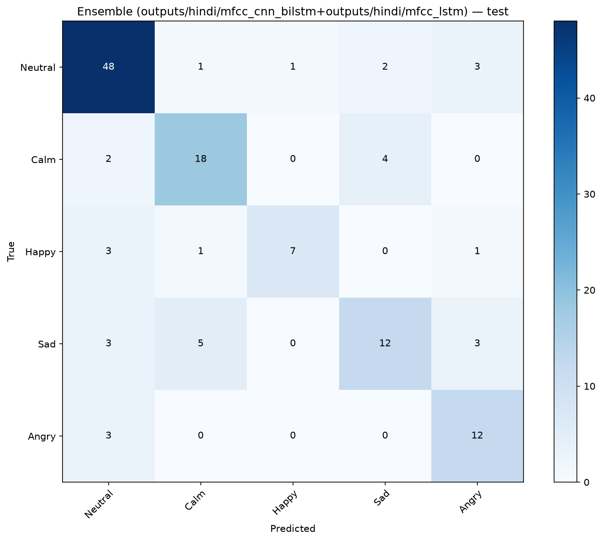
  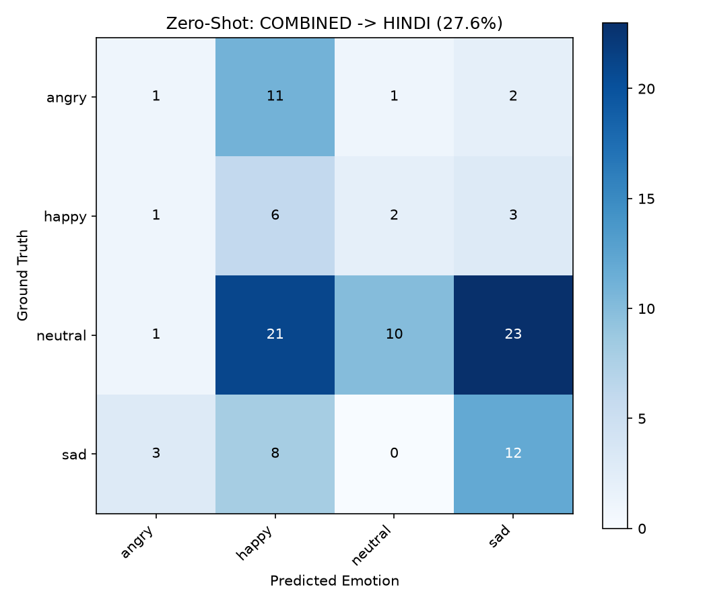
</p>

---

## 11. Phase 9: Audio Behaviour Analysis Engine & WebUI Platform

In addition to categorical emotion classification, the platform features a real-time **Audio Behaviour Analysis Engine** (`src/ser/features/behavior.py`) that extracts comprehensive speech dynamics to diagnose conversational engagement and communicative style.

### Key Behavioral Dimensions
1. **Speaking Speed**: Syllables per second (detected via onset envelope spectral peaks) and estimated words per minute (WPM), categorized as `Slow`, `Normal`, or `Fast`.
2. **Pause Frequency**: Voice Activity Detection (VAD) silence duration ratio and pauses/min (threshold >= 250 ms), categorized as `Low`, `Normal`, or `Frequent`.
3. **Vocal Energy**: Root-Mean-Square (RMS) dB loudness dynamics, categorized as `Low`, `Moderate`, or `High`.
4. **Pitch Variation**: Fundamental frequency ($F_0$) trajectory via probabilistic YIN (`librosa.pyin`), standard deviation, and semitone pitch excursion, categorized as `Monotone`, `Stable`, or `Dynamic`.
5. **Overall Speaker Behaviour Profile**: Rule-based synthesis combining acoustic dynamics and emotion confidence into diagnostic labels (`Engaged Speaker`, `Energetic / Assertive`, `Hesitant / Guarded`, `Distressed / Agitated`, `Flat / Monotone`, `Passive / Subdued`).

### CLI and Web Application
- **CLI Analyzer**:
  ```bash
  python scripts/analyze_audio.py --audio sample.wav
  python scripts/analyze_audio.py --audio sample.wav --json
  ```
- **Next.js Frontend Studio**:
  ```bash
  cd frontend
  npm run dev
  # Serves at http://localhost:3000 with real-time waveform visualizer and behavioral report
  ```
- **FastAPI Inference Microservice**:
  ```bash
  python scripts/inference_api.py --host 127.0.0.1 --port 8000
  # Serves REST API at http://127.0.0.1:8000 (/health, /models, /predict)
  ```

---

## 12. Master Research Report

For the complete technical dissertation covering the theoretical foundation, Base vs. Large model comparison, layer pooling dynamics, cross-corpus zero-shot transfer, and production deployment specifications, consult:

> [!TIP]
> **[FINAL_RESEARCH_REPORT.md](FINAL_RESEARCH_REPORT.md)**: Master technical report documenting the comprehensive multi-corpus findings, mathematical formulation, and architecture roadmap.

---

## 13. Multi-Dataset Milestone Roadmap

- [x] **Phase 1: Full 8-Model RAVDESS Benchmark + Ensemble — COMPLETED**
  - Outputs isolated under `outputs/ravdess/`. Peak Baseline Ensemble: **68.75%** (Macro-F1: 0.6815).
- [x] **Phase 2: Ingest & Benchmark CREMA-D (7,442 clips) — COMPLETED**
  - All 8 models trained and ranked under `outputs/cremad/`. Peak Ensemble: **75.57%** (Macro-F1: 0.7594).
- [x] **Phase 3: Ingest & Benchmark SAVEE (480 clips) — COMPLETED**
  - Baseline audit isolated under `outputs/savee/`.
- [x] **Phase 4: Ingest & Benchmark TESS (2,800 clips) — COMPLETED**
  - Word-disjoint prompt partition. Peak Ensemble: **100.00%** (Macro-F1: 1.0000).
- [x] **Phase 5: Performance Enhancements (SAVEE & RAVDESS Solved) — COMPLETED**
  - **SAVEE Overfitting Solved**: 25.0% -> **51.67% Ensemble Accuracy**, **0.3860 Macro-F1** (+25.8% leap, 5.8x F1).
  - **RAVDESS Peak Ensemble Raised**: 68.75% -> **73.75% Ensemble Accuracy**, **0.7207 Macro-F1** (+5.0% leap).
  - **RAVDESS Single-Model Raised**: 67.08% -> **72.92% HuBERT Accuracy** (+40.42% over baseline HuBERT).
  - **RAVDESS Wav2Vec2 Raised**: 50.00% -> **67.50% Wav2Vec2 Accuracy** (+17.50% over baseline Wav2Vec2).
- [x] **Phase 6: Cross-Corpus Zero-Shot Evaluation Suite — COMPLETED**
  - Built automated evaluation pipeline [`scripts/evaluate_cross_corpus.py`](scripts/evaluate_cross_corpus.py).
  - Full cross-corpus generalization matrix across all 4 datasets saved in `outputs/cross_corpus/`.
- [x] **Phase 7: Universal Multi-Corpus Foundation Model — COMPLETED**
  - Standardized multi-corpus pipeline [`scripts/preprocessing/preprocess_combined.py`](scripts/preprocessing/preprocess_combined.py).
  - Trained Universal HuBERT Foundation model achieving **68.31% Accuracy** / **0.6779 Macro-F1** across 1,701 unseen test clips across all 4 datasets simultaneously.
- [x] **Phase 8: Authentic Hindi Speech Corpus & Cross-Lingual Evaluation — COMPLETED**
  - Standardized 862 Hindi clips from Vaani, Indian-TTS, and Audio-Emotion corpora.
  - Zero-shot cross-lingual transfer evaluated under `outputs/cross_corpus/universal_hubert_to_hindi/`.
- [x] **Phase 9: Audio Behaviour Analysis Engine & Next.js Studio — COMPLETED**
  - Comprehensive acoustic feature extraction engine (`src/ser/features/behavior.py`) for tempo, pauses, pitch, and energy.
  - Interactive Next.js Frontend Studio with live microphone recording, waveform canvas, and diagnostic report generation (`frontend/`).
- [x] **Phase 10: Master Research Report & Publication Documentation — COMPLETED**
  - Complete master report in `FINAL_RESEARCH_REPORT.md` and literature registry in `reports/literature_survey_references.md`.

